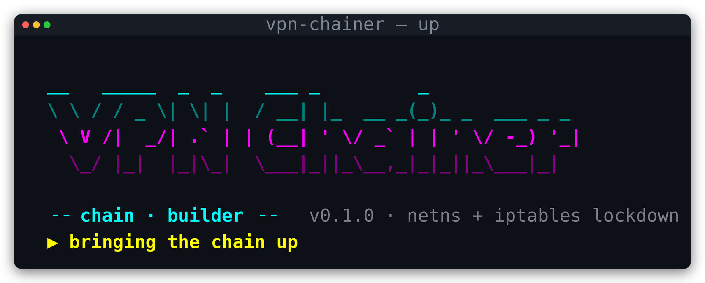
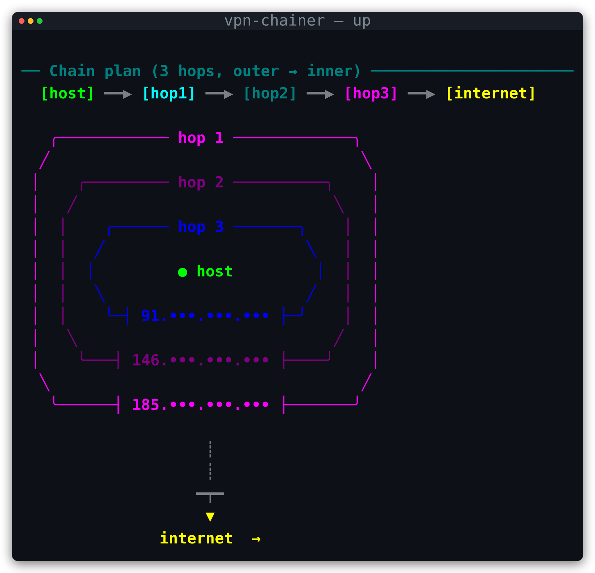
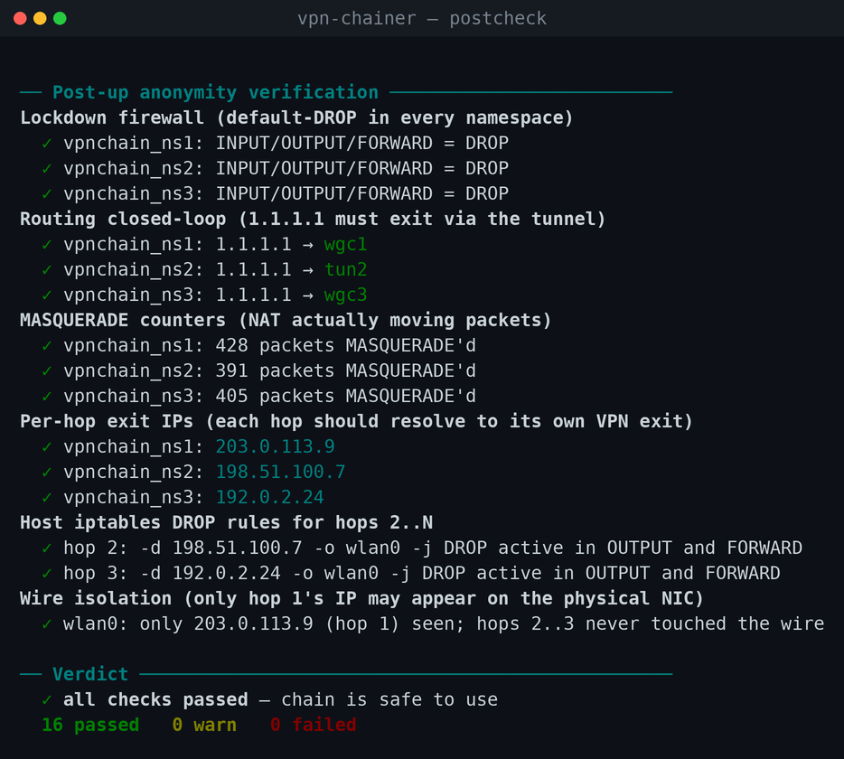
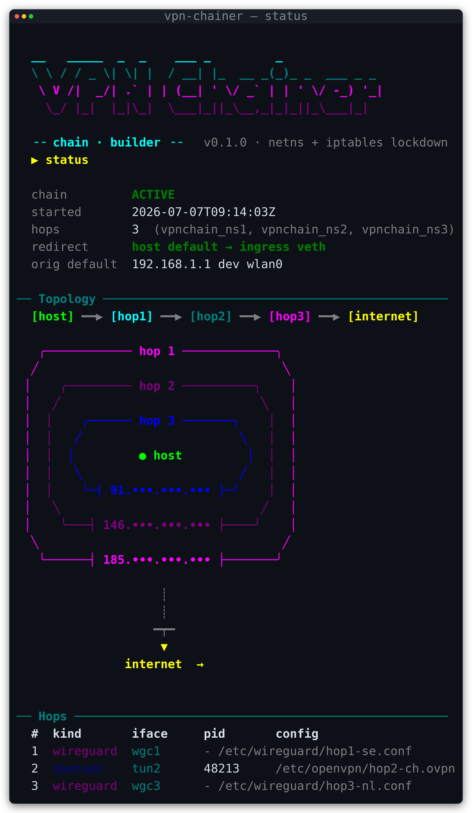
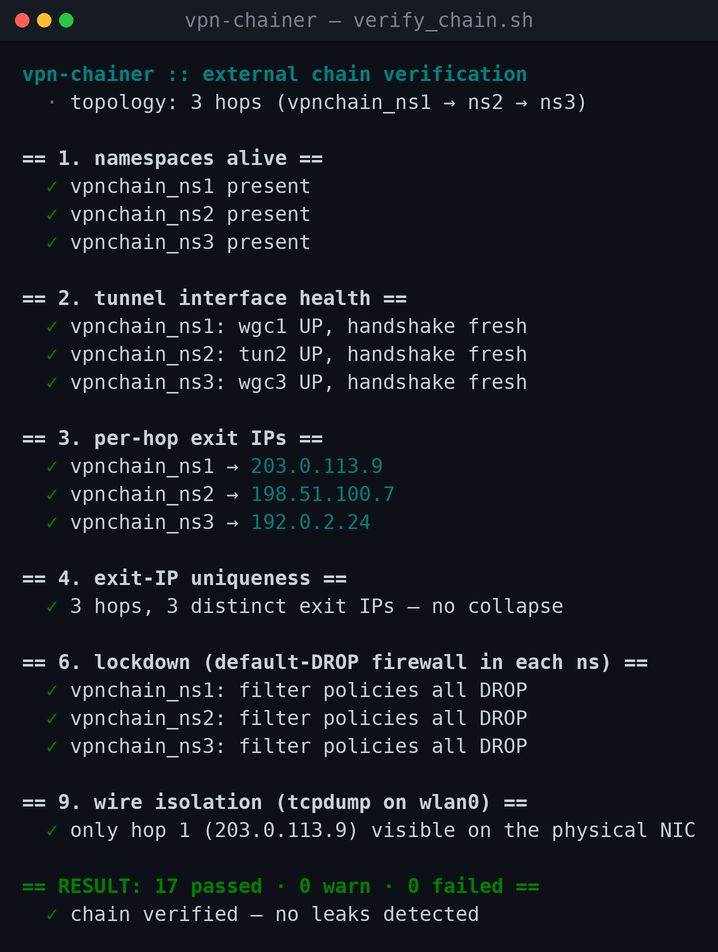

# vpn-chainer

> Chain multiple WireGuard / OpenVPN tunnels on Linux with namespace isolation,
> default-deny firewalls, and a built-in leak detector. Onion-style multi-hop
> anonymity in a single CLI — `up`, `status`, `down`.

<!-- Drop a screenshot of `up` here. The banner + chain plan + post-up
     verification all in one shot make a great first impression. -->
<!--  (screenshot not captured yet; capture per docs/screenshots/README.md, then: git add -f docs/screenshots/*.png) -->

---

## Why

A single VPN connection has two big problems:

1. **Single point of trust.** The VPN provider sees both *who you are* (your
   real IP) and *what you do* (the destinations you contact).
2. **Single point of failure.** If the tunnel drops, your traffic falls back
   to the bare-metal route — instant deanonymisation.

A multi-hop chain (a.k.a. *onion routing*) splits trust across N independent
providers, and a properly built kill switch guarantees that a hop failure
yields *no traffic* rather than *bypassed traffic*.

`vpn-chainer` is the tool that builds and supervises that chain on a regular
Linux host, without virtual machines.

## How it works

Every hop runs inside its own [Linux network namespace](https://man7.org/linux/man-pages/man8/ip-netns.8.html).
Namespaces are wired together with veth pairs and connected to the host with
two veths — one for **plaintext ingress** and one for the **encrypted carrier**
that finally leaves the wire.

```
host  ─[ingress]─►  ns_N (VPN_N)  ─►  ns_{N-1}  ─►  …  ─►  ns_1 (VPN_1)  ─[carrier]─►  internet
```

Onion semantics: host plaintext is wrapped first by VPN_N (innermost), then
VPN_{N-1}, …, finally VPN_1 (outermost). On the wire your ISP only sees a
single peer — VPN_1's server IP.

The CLI prints this exact topology before every `up` and on every `status`:

<!-- Screenshot: chain_orbit visualisation. Looks like nested rings with the
     IP of each hop on the bottom border of its ring. -->
<!--  (screenshot not captured yet; capture per docs/screenshots/README.md, then: git add -f docs/screenshots/*.png) -->

## Quick Start

```bash
# install (one-liner — see "Installation" below for details)
curl -fsSL https://raw.githubusercontent.com/himfatihoner/vpn-chainer/main/install.sh | sudo bash

# bring a 3-hop chain up (script exits when it's ready)
sudo vpn-chainer up \
    -c ~/configs/jp.conf  \
    -c ~/configs/de.ovpn  \
    -c ~/configs/us.conf

# check it
vpn-chainer status

# tear it down (restores host's original network state)
sudo vpn-chainer down
```

`up` ends with an automatic anonymity verification suite — namespaces alive,
tunnels up, exit IPs distinct, lockdown firewall in place, and a live
`tcpdump` snapshot of the physical NIC confirming no packet is reaching any
hop ≥ 2 directly.

<!-- Screenshot: the post-up verification block with the green ✓s. -->
<!--  (screenshot not captured yet; capture per docs/screenshots/README.md, then: git add -f docs/screenshots/*.png) -->

## Installation

### One-line install (recommended)

```bash
curl -fsSL https://raw.githubusercontent.com/himfatihoner/vpn-chainer/main/install.sh | sudo bash
```

The installer:

1. Detects your distro (Debian / Ubuntu / Kali / Fedora / Arch / Alpine).
2. Installs runtime dependencies through your package manager.
3. Copies the project to `/usr/local/share/vpn-chainer/`.
4. Drops a tiny wrapper at `/usr/local/bin/vpn-chainer` so the command is on
   `PATH` everywhere.
5. Doesn't touch your system Python — the project is **pure stdlib**, no pip
   needed.

Before piping to `bash`, you can read the script first if you'd rather see
what it does:

```bash
curl -fsSL https://raw.githubusercontent.com/himfatihoner/vpn-chainer/main/install.sh | less
```

### Manual install

```bash
git clone https://github.com/himfatihoner/vpn-chainer.git
cd vpn-chainer
sudo ./install.sh        # same script, run from a local checkout
```

### Dependencies

| Required | Purpose |
|---|---|
| Python ≥ 3.7 | the CLI itself |
| `iproute2` (`ip` command) | namespace + veth + routing |
| `iptables` | NAT, lockdown rules |
| `openvpn` | OpenVPN backend |
| `wireguard-tools` (`wg`) | WireGuard backend |
| `traceroute`, `curl`, `jq` | verification (`verify_chain.sh`) |

Distro-specific install commands:

```bash
# Debian / Ubuntu / Kali
sudo apt install python3 iproute2 iptables openvpn wireguard-tools \
                 traceroute curl jq

# Fedora / RHEL
sudo dnf install python3 iproute iptables openvpn wireguard-tools \
                 traceroute curl jq

# Arch
sudo pacman -S   python  iproute2 iptables openvpn wireguard-tools \
                 traceroute curl jq
```

### Uninstall

```bash
sudo vpn-chainer down 2>/dev/null   # if a chain is up, tear it down first
sudo /usr/local/share/vpn-chainer/uninstall.sh
```

## Usage

### `up` — bring up a chain

```bash
sudo vpn-chainer up [-n N] [-c PATH ...] [--type wg|ovpn] \
                    [--no-redirect] [--keep-host-dns] \
                    [--chain-dns IP] [-y] [-v]
```

| Flag | Meaning |
|---|---|
| `-n, --hops N` | Number of hops (1 – 8). Prompted if omitted. |
| `-c, --config PATH` | VPN config path. Repeat per hop, **outer → inner**. |
| `--type {wg,ovpn}` | Force the VPN type for the matching `-c`. Otherwise the type is auto-detected from the file content. |
| `--no-redirect` | Don't change the host's default route. The chain is built but the host keeps using the original wire. Use `sudo ip netns exec vpnchain_nsN <cmd>` to reach it. Debug only. |
| `--keep-host-dns` | Don't rewrite `/etc/resolv.conf`. **DNS-leak risk** — verify with a sniffer. |
| `--chain-dns IP` | DNS server pushed into the chain (default `1.1.1.1`). |
| `-y, --yes` | Skip the "Proceed?" confirmation. |
| `-v, --verbose` | Echo every shell command executed. |

OpenVPN configs that contain a bare `auth-user-pass` directive (interactive
credentials) trigger a username/password prompt before bring-up. The
credentials are written to `/run/vpnchainer/creds/ovpn-K.cred` (chmod 600)
and deleted on teardown. Configs that already point `auth-user-pass <path>`
at a file are used as-is.

### `status` — show what's running

```bash
vpn-chainer status [--json]
```

Reads JSON state from `/var/lib/vpnchainer/` and reports whether the chain is
**ACTIVE**, **STALE** (state recorded but kernel state gone — happens after
reboots) or **inactive**. Doesn't need root.

<!-- Screenshot: status command output -->
<!--  (screenshot not captured yet; capture per docs/screenshots/README.md, then: git add -f docs/screenshots/*.png) -->

### `down` — tear down

```bash
sudo vpn-chainer down [-v]
```

Reads the persisted state and reverses every change made by `up`:

1. Restores the host's default route.
2. Removes the `/32` pin to VPN_1's server.
3. Drops the `iptables` MASQUERADE / FORWARD / DROP rules added on the host.
4. Restores `/etc/resolv.conf` (regular file or symlink — both handled).
5. Stops every OpenVPN process by pid.
6. Deletes every `vpnchain_*` namespace (which also wipes its veths,
   wg interfaces, and lockdown rules).
7. Deletes the JSON state under `/var/lib/vpnchainer/` and the per-hop
   pid / credential files. OpenVPN log files under `/run/vpnchainer/logs/`
   are kept for post-mortem (tmpfs, so cleared on reboot; `uninstall.sh`
   removes the whole tree).

Idempotent — safe to re-run.

### `recover` — force-clean leftover state

```bash
sudo vpn-chainer recover [-y] [-v]
```

Use this after a `kill -9`, after an unclean reboot, or whenever `status`
reports **STALE**. It does the same job as `down` plus a pattern-based scan
for orphan `vpnchain_*` namespaces and `vpnc*` veth interfaces.

## Anonymity Guarantees

Wire isolation is enforced at **three independent layers** so no single
mistake (a stale route, a bug, a manual `iptables -F`) can leak.

### 1. Routing

The host has exactly one `/32` route pinning hop 1's server IP to the
original gateway. Every other public destination — including hop 2..N's
server IPs — falls through to the default route, which is the ingress veth.
Result: from the routing table alone, only hop 1's IP is reachable directly
on the wire.

### 2. Host `iptables` DROP rules

For each hop K ≥ 2, two rules are appended:

```
iptables -A OUTPUT  -d <hop_K_IP> -o <NIC> -j DROP
iptables -A FORWARD -d <hop_K_IP> -o <NIC> -j DROP
```

Even if a buggy app explicitly bound to the physical NIC and tried to reach
hop_K, the kernel would drop the packet.

### 3. Per-namespace lockdown firewall

When each hop comes up, `vpn-chainer` slams a default-`DROP` filter into its
namespace. Inside ns_k only this is allowed:

| Chain | Allowed |
|---|---|
| `OUTPUT` | `lo` · conntrack RELATED/ESTABLISHED · the tunnel iface · the upstream veth (encrypted carrier from the wg socket) |
| `INPUT` | `lo` · conntrack RELATED/ESTABLISHED · upstream veth (encrypted-carrier replies) |
| `FORWARD` | conntrack RELATED/ESTABLISHED · downstream-veth → tunnel · tunnel → downstream-veth |

If the tunnel iface goes down for any reason, the FORWARD policy `DROP`
catches the would-be leakage. There is no allowed path that lets a packet
hop *around* the tunnel — the chain fails closed for that hop and every
deeper hop. `ip6tables` is forced `DROP` everywhere as a belt-and-suspenders
guard against IPv6 leaks (the IPv6 stack is also `disable_ipv6=1` per
namespace).

### State persistence (reboot survival)

| Path | Persists across reboot? | Contents |
|---|---|---|
| `/var/lib/vpnchainer/` | yes | `topology.json`, `host_state.json` (orig default route + iptables rules + resolv backup), `chain.json`, `hops.json` (per-hop iface + OpenVPN pids), `resolv-backup/` |
| `/run/vpnchainer/` | no (tmpfs) | OpenVPN pidfiles, log files, credential files |

If the chain is "killed" by an unclean reboot, the kernel state evaporates
but `host_state.json` still describes what was changed. `vpn-chainer status`
reports **STALE** and `vpn-chainer recover` rolls everything back including
restoring `/etc/resolv.conf` from the backup.

## Verification

Two layers of verification ship with the project.

### Inline (runs automatically on `up`)

`chainer/postcheck.py` runs at the end of every `up`:

1. Lockdown active in every namespace (filter policies all `DROP`).
2. Routing closed-loop (`ip route get 1.1.1.1` resolves to the tunnel iface
   in every namespace).
3. MASQUERADE counters non-zero (NAT actually moving packets).
4. Distinct exit IPs from inside each namespace.
5. iptables DROP rules present for every hop ≥ 2.
6. **Wire isolation** — `tcpdump` listens on the physical NIC for ~8 s while
   traffic is generated; reports a `LEAK` if any packet is seen to a hop ≥ 2
   IP.

The verdict is printed in colour with a rolled-up `passed / warn / failed`
counter.

### External (`verify_chain.sh`)

A standalone bash harness that can be re-run any time the chain is up:

```bash
sudo ./verify_chain.sh                 # standard sweep
sudo ./verify_chain.sh --kill-test 2   # destructive: take hop 2 offline,
                                       # confirm host loses internet
sudo ./verify_chain.sh --encap         # tcpdump packet snapshot per ns
```

`--kill-test K` is the strongest safety check — it brings hop K down for a
few seconds and verifies that the host's internet *actually* goes away. If
the chain were leaking around hop K, the host would still be online and the
test would fail loudly.

<!-- Screenshot: verify_chain.sh output with all green check marks -->
<!--  (screenshot not captured yet; capture per docs/screenshots/README.md, then: git add -f docs/screenshots/*.png) -->

## Architecture

```
vpn_chainer.py          CLI entrypoint (subcommands: up, down, status, recover)
chainer/
├── detect.py           Auto-detect WG vs OVPN; resolve server IP; flag auth-user-pass
├── netns.py            Namespaces + veth pairs + IPv6 disable + apply_lockdown
├── vpn.py              Per-hop bring-up (wg setconf / openvpn --route-noexec)
├── host.py             Two-phase host plumbing: SNAT + default redirect; reboot-safe state
├── state.py            Persistent JSON state (chain.json, hops.json) + kernel-alive check
├── chain.py            Orchestrator (build / teardown / status / recover)
├── postcheck.py        Inline anonymity verifier (runs on every `up`)
├── verify.py           Per-hop probe + final traceroute helpers
└── util.py             Subprocess helpers + ANSI color helpers + banner / orbit / chain_flow
verify_chain.sh         External post-up verifier (jq + tcpdump-based)
install.sh              One-line installer
uninstall.sh            Mirror image of install.sh
```

## Troubleshooting

| Symptom | Likely cause | Fix |
|---|---|---|
| `wg: command not found` | wireguard-tools not installed | `sudo apt install wireguard-tools` |
| Chain comes up but no internet | DNS not yet resolving / restrictive ISP | wait 5 s; check `vpn-chainer status` shows `ACTIVE` |
| Some sites hang on TLS | nested-tunnel MTU | `sudo ip netns exec vpnchain_nsK ip link set wgcK mtu 1380` |
| `verify_chain.sh` reports LEAK | iptables DROP missing or routing changed externally | `sudo vpn-chainer down && sudo vpn-chainer up …` to rebuild |
| `status` shows STALE after reboot | kernel state went away with the reboot, on-disk state remained | `sudo vpn-chainer recover` |
| OpenVPN config wants a password | `auth-user-pass` directive | the script prompts automatically — paste cred when asked |
| Subnet `10.200.0.0/16` is taken | LAN already uses that range | the script auto-falls-back to `10.201`, `10.202`, then `172.31`. If still busy: free up your routing table |

## Manual Recovery

If the system is wedged badly enough that `vpn-chainer recover` won't help:

```bash
# 1) Delete every vpnchain_* namespace
for ns in $(ip netns list | awk '/^vpnchain_ns/ {print $1}'); do
    sudo ip netns del "$ns"
done

# 2) Remove dangling host-side veths
for v in $(ip -br link | awk '/^vpnc[0-9]+o|^vpncIo/ {print $1}' | cut -d@ -f1); do
    sudo ip link del "$v"
done

# 3) Restore the original default route (read from host_state.json)
cat /var/lib/vpnchainer/host_state.json    # see orig_default_gw, orig_default_iface
sudo ip route replace default via <orig_gw> dev <orig_iface>

# 4) Drop the MASQUERADE rule
sudo iptables -t nat -D POSTROUTING -s 10.200.0.0/16 -o <orig_iface> -j MASQUERADE

# 5) Restore /etc/resolv.conf
ls -la /etc/resolv.conf      # was it a symlink?
sudo rm /etc/resolv.conf
sudo ln -s /run/systemd/resolve/stub-resolv.conf /etc/resolv.conf
# (or: copy back from /var/lib/vpnchainer/resolv-backup/resolv.conf)

# 6) Wipe state
sudo rm -rf /var/lib/vpnchainer /run/vpnchainer
```

## Limitations

- **WireGuard kernel module required** (Linux ≥ 5.6, or `wireguard-dkms`).
- **IPv4 only** for the chain itself. The host's IPv6 stack is left alone but
  IPv6 inside namespaces is sysctl-disabled and `ip6tables` policy is `DROP`.
  If your ISP forces IPv6 dual-stack, consider blocking it on the host with
  `sudo ip6tables -P OUTPUT DROP` while the chain is up.
- **Maximum 8 hops.** Beyond that, MTU shrinks below 1280 and the kernel
  refuses to forward. Most use cases need 2–3 hops anyway.
- **WireGuard `PostUp`/`PostDown`** scripts are intentionally ignored —
  configs are parsed manually for predictability. Bring your own with
  `--no-redirect` if you need them.
- **OpenVPN management interface** isn't wired up. Connection state changes
  during the chain's lifetime are not auto-recovered; if a tunnel drops the
  chain stays down (fail-closed) and the user has to `down` + `up` again.
- **No SELinux / AppArmor profiles** ship with the project. On Fedora/RHEL
  with enforcing SELinux you may need to relax labels for `ip netns exec`.

## Contributing

Project is small (≈ 2,800 LOC), no external Python dependencies. To hack on
it:

```bash
git clone https://github.com/himfatihoner/vpn-chainer.git
cd vpn-chainer
python3 -m py_compile vpn_chainer.py chainer/*.py    # quick smoke
bash -n verify_chain.sh                              # bash syntax check
```

Pull requests welcome. Please run the manual recovery procedure above between
test rounds — partial state can confuse subsequent runs.

## License

This project is licensed under the GNU General Public License v3.0
(SPDX: `GPL-3.0`). See [LICENSE](LICENSE) for the full text.
